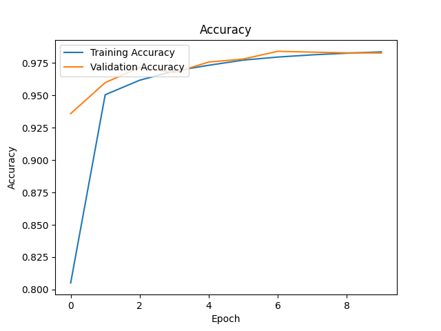
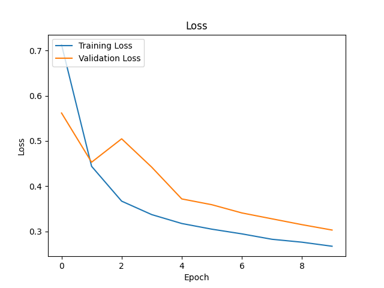
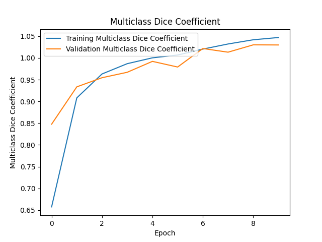
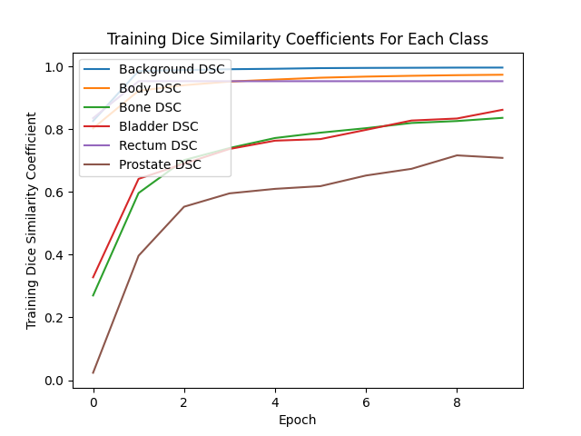
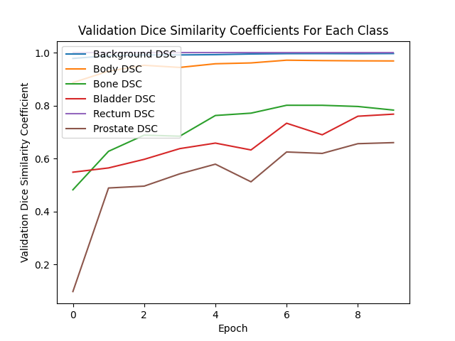
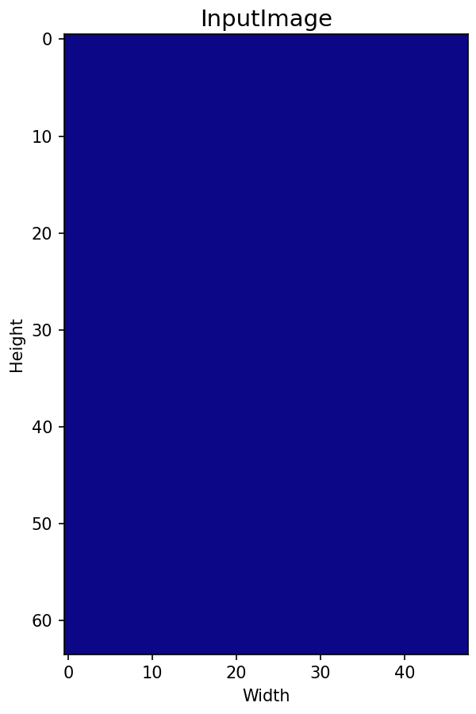
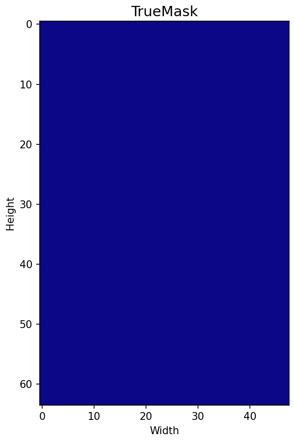
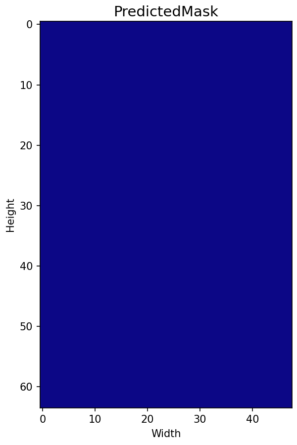

# Segmentation of 3D Prostate MRI Data Using 3D Improved UNet Model
## Task 7 - Amber Chen s4810145

## Overview
This project implements a 3D Improved UNet for semantic segmentation of prostate MRI data. 
The model segments 6 anatomical classes, background, body, bone, bladder, rectum, and prostate, from volumetric MRI scans using a deep encoder-decoder network with residual context modules, skip connections, and deep supervision.

This repository includes:
* A full PyTorch implementation of the 3D Improved UNet architecture 
* A dataset loader and preprocessing pipeline 
* Model training, validation, and testing scripts with full metric logging
* Plasma-coloured 3D visualisations of model predictions

## 3D Improved UNet Architecture 
The 3D Improved UNet is a deep convolutional neural network designed for volumetric medical image segmentation, such as prostate MRI scans.
It extends the original UNet architecture by introducing residual context encoding, instance normalisation, deep supervision, and multiple segmentation layers - all optimised for 3D medical data.

The network consists of two main paths:
* an encoder (downsampling path) that captures context and abstract feautres
* a decoder (upsampling path) that reconstructs precise spatial details 

The encoder and decoder are connected through skip connections, which concatenate the corresponding feature maps between both paths to preserve spatial information that may otherwise be lost during downsampling.


The 3D Improved UNet was specifically developed to segment 3D volumetric data. This implementation follows the same core architecture, with the addition of:
* Context modules for residual feature extraction 
* Localisation modules for spatial refinement 
* Multiple segmentation layers for deep supervision 
* Instance normalisation in place of batch normalisation (to handle MRI intensity variety)
* Leaky ReLU (α = 0.01) activation functions for smoother gradients
* Dropout (30%) within context layers for improved regularisation

| 3D Improved UNet (resource) |
| --- |
|  |

Although the  originally employed multiclass Dice loss, this implementated uses a hybrid Dice-Cross Entropy loss (DiceCELoss) with class weighting and optional lable smoothing. This approach provided more stable gradient flow, improved convergence speed, and yielded higher Dice similarity coefficients across all classes during evaluation. 

### Downsampling Path (Encoder)
The downsampling path is composed of five levels, each progressively halving the spatial resolution and doubling the number of feature maps (from 16 to 256). Each level consists of a DownBlock which includes:
* A 3x3x3 convolution (stride=2, expect the first level which uses stride=1)
* A Leaky ReLU activation 
* A ContextModule, a residual sub-block containing:
    * Two 3x3x3 convolutions
    * Instance normalisation after each convolution 
    * A dropout layer (p=0.3) between them
    * A residual connection to preserve low-level features

This residual structure allows the network to learn abstract volumetric context while maintaining stable gradients and avoiding vanishing information loss during deep training. 

### Upsampling Path (Decoder)
The upsampling path reconstructs the full-resolution segmentation map from the compressed representatino learned by the encoder. It consists of four UpBlocks, each of which:
* Upsamples the feature map using a 2x2x2 tranposed convolution 
* Applies a 3x3x3 convoltion and Leaky ReLU activation 
* Concatenates the result witht he feature map from the corresponding encoder level (skip connection)
* Passes the combined output through a LocalisationBlock, which refines and reduces feature dimensionality using:
    * A 3x3x3 convolution (spatial refinement)
    * A 1x1x1 convolution (feature compression)

Each successive upsampling layer halves the number of feature maps (eg. 256 -> 128 -> 64 -> 32 -> 16) while recovering spatial detail lost during encoding.

### Segmentation Layers (Deep Supervision)
To improve learning efficiency and gradient propagation, the model employes three segmentation layers positioned at different decoder paths:
* Each SegmentationLayer uses a 1x1x1 convolution to predict per-class logits
* Lower-resolution segmentation maps are upsampled (via trilinear interpolation) and added to higher-resolution maps element-wise
* This deep supervision ensures that intermediate layers contribute to the overall segmentation accuracy and helps the model converge faster and more stably

### Output Layer
The final segmentation map is generated through a 1x1x1 convolution followed by a softmax activation, producing a six-channel probability map corresponding to the six anatomical classes (background, body, bone, bladder, rectum and prostate). Each voxel in the 3D MRI volume is classified according to the class with the highest predicted probability.


## Dataset
For this project, the 3D Improved UNet model was trained and evaluated on the , which contains male pelvis MRI data from 38 patients and 211 volumetric MRI scans.

Each image was manually segmented by an expert MR physicist into six anatomical classes - background, body, bone, bladder, rectum and prostate - making it suitable for multiclass volumetric segmentation.

The dataset was split into 80% training, 10% validation, and 10% testing subsets, following the recommended ratio for the UNet-style segmentation models (reference).

To improve generalisation and reduce overfitting, 3D geometric augmentations were applied to the training set through reflections in all three spatial dimensions (eight total combinations).

Additionally, each MRI volume was downsampled by a factor of 0.5 in each dimension to significantly reduce memory usage and training time while retaining sufficinet anatomical detail for accurate segmentation. 


## Usage
### Dependencies
This implementation was developed using PyTorch and supporting libraries for medical data handling and visualisation.
The following dependencies are required:
```
torch 2.3.0
torchvision 0.18.0
numpy 1.26.4
matplotlib 3.8.4
nibabel 5.2.1
```

### Reproducing results
To reproduce the traiing and prediction results shwon below:
1. Download the [dataset](reference)
2. Ensure the folder structure follows the format below:
```
> HipMRI_study_complete_release_v1
__> semantic_labels_anon
____> Case_042_Week0_SEMANTIC_LFOV.nii
______> Case_042_Week0_SEMANTIC_LFOV.nii
____> Case_041_Week0_SEMANTIC_LFOV.nii
______> Case_041_Week0_SEMANTIC_LFOV.nii
____ .
____ .
____ .
____> Case_004_Week1_SEMANTIC_LFOV.nii
______> Case_004_Week1_SEMANTIC_LFOV.nii
____> Case_004_Week0_SEMANTIC_LFOV.nii
______> Case_004_Week0_SEMANTIC_LFOV.nii
__> semantic_MRs_anon
____> Case_042_Week0_LFOV.nii
______> Case_042_Week0_LFOV.nii
____> Case_041_Week0_LFOV.nii
______> Case_041_Week0_LFOV.nii
____ .
____ .
____ .
____> Case_004_Week1_LFOV.nii
______> Case_004_Week1_LFOV.nii
____> Case_004_Week0_LFOV.nii
______> Case_004_Week0_LFOV.nii
```

3. Update the paths in train.py 
```
DATA_ROOT_IMAGES = "/path/to/HipMRI_Study_open/semantic_MRs"
DATA_ROOT_LABELS = "/path/to/HipMRI_Study_open/semantic_labels_only"
SAVED_RESULTS_PATH = "./results"
```

4. To train, validate, and test the model while saving plots and metrics rung the following command
```
python train.py
```

5. To load the trained model and generated 3D animated GIFs for input, true, and predicted segmentations:
```
python predict.py
```

## Training and Validation Results
The model was trainged for 10 epochs using the DiceCELoss - a hybrid of multiclass Dice loss and weighted cross entropy.

This approach improved convergence stability and per-class performance, especially for smaller organs such as the bladder and prostate.

As shown in the figures below, training proceeded smoothly.

Both training and validation accuracy increase stadily, reaching around 98% by the final epoch 


As expected, training and validation loss decreased consistently, confirmed successful optimisation and stable convergence.


The multiclass Dice coefficient - measuring overall segmentation overlap across all classes - rose sharply to around 1.0, indicating excellent alignment between predicted and ground-truth segmentations. As expected, the multiclass dice similarity coefficient increased during training.



As seen below, Dice scores improved for every anatomical region, showing that the model successfully learned to distinguish both large structures (body, bone) and smaller, more irregular organs (bladder, rectum, prostate).
 | 
--- | ---


## Testing and Visualisation
To qualitatively assess model performance, three test samples were randomly selected and visualised. The predictions were rendered as 3D animated GIFs showing clear structural boundaries and consistent alignment wiht ground-truth lables

Input | True | Predicted | Statistics
--- | --- | --- | ---
 |  |  | Multiclass DSC: 0.8809<br>Background DSC: 0.9964<br>Body DSC: 0.9693<br>Bone DSC: 0.7856<br>Bladder DSC: 0.7463<br>Rectum DSC: 1.0000<br>Prostate DSC: 0.7877
 |  |  | Multiclass DSC: 0.8746<br>Background DSC: 0.9970<br>Body DSC: 0.9675<br>Bone DSC: 0.7895<br>Bladder 0.8008<br>Rectum DSC: 1.0000<br>Prostate DSC: 0.7026
 |  |  | Multiclass DSC: 0.9160<br>Background DSC: 0.9981<br>Body DSC: 0.9737<br>Bone DSC: 0.8327<br>Bladder DSC: 0.9487<br>Rectum DSC: 1.0000<br>Prostate DSC: 0.7430

As shown aboce, all three examples achieved Dice Similarity Coefficients (DSC) above 0.7 across all anatomical structures, confirmed that the 3D Improvement UNet generalises well to unseen data.

The model accurately segmented both large structures (body, bone) and smllaer, irregular regions (bladder, rectum, prostate), maintaining excellent overlap with the ground-truth masks.

The avereage Dice scores across all three test examples are presented below.

Multiclass | Background | Body | Bone | Bladder | Rectum | Prostate
--- | --- | --- | --- | --- | --- | ---
0.8905 | 0.99972 | 0.9702 | 0.8026 | 0.8319 | 1.000 | 0.7444

As seen above, all Dice coefficients exceed the 0.7 target threshold, demonstrating the high accuracy and robustness of the 3D Improved UNet for multiclass prostate MRI segmentation.


## References
refernce
